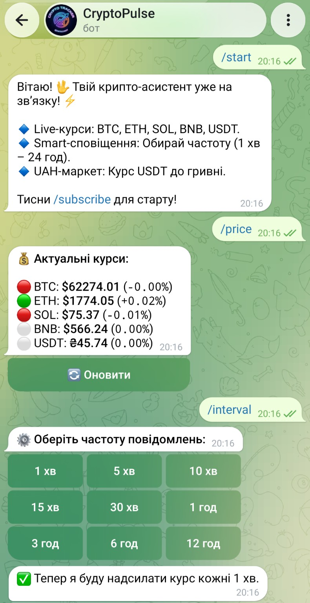
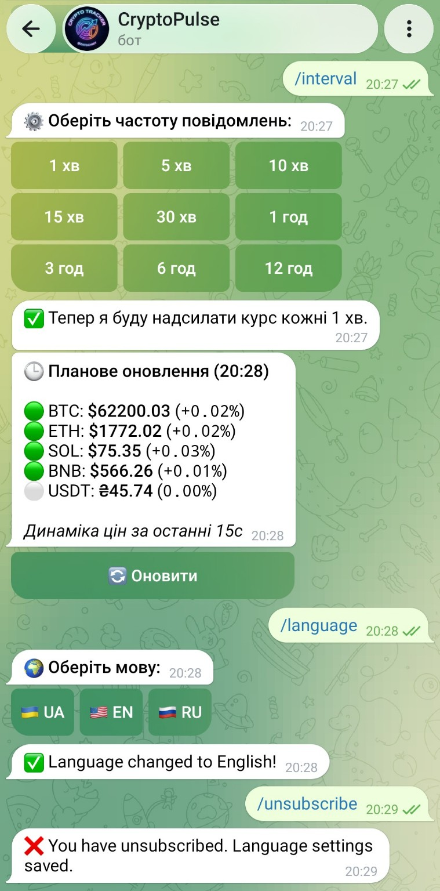
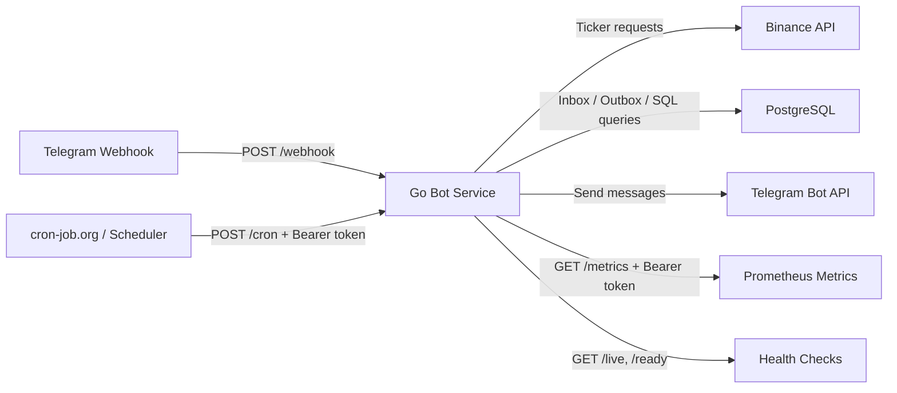

# CryptoPulse Telegram Bot

[](https://github.com/igor-zatochniy/cryptopulse-telegram-bot/actions/workflows/ci.yml)
[](https://t.me/btc_eth_usdt_bot)

Production-орієнтований Telegram-сервіс на Go. Він відстежує ціни криптовалют, зберігає налаштування підписників у PostgreSQL, надсилає заплановані Telegram-сповіщення, має health/readiness endpoints і постачається як посилений Docker-образ.

Проєкт навмисно компактний, але побудований як реальний сервіс: міграції бази даних, graceful shutdown, CI-перевірки, Prometheus-метрики, rate limits, Docker hardening і явна обробка операційних помилок.

## Спробувати бота

Відкрийте CryptoPulse у Telegram:

[**Запустити @btc_eth_usdt_bot**](https://t.me/btc_eth_usdt_bot)

Після відкриття натисніть **Start** або надішліть команду:

```text
/start
```

## Demo





## Основні команди

| Команда | Призначення |
| --- | --- |
| `/start` | Запустити бота та переглянути вступне повідомлення |
| `/subscribe` | Увімкнути регулярні сповіщення |
| `/unsubscribe` | Вимкнути регулярні сповіщення |
| `/price` | Отримати актуальні ціни криптовалют |
| `/interval` | Змінити інтервал сповіщень |
| `/language` | Вибрати мову повідомлень |

## Deployment

- **Status:** Live
- **Platform:** Koyeb
- **Bot:** [@btc_eth_usdt_bot](https://t.me/btc_eth_usdt_bot)
- **Runtime:** Distroless Docker image, non-root
- **Health checks:** `/live` and `/ready`

## Можливості

- Telegram-команди для підписки, вибору мови, оновлення цін і керування інтервалом сповіщень.
- Заплановані сповіщення про ціни криптовалют через автентифікований endpoint `/cron`.
- Кеш цін на основі Binance ticker requests із часом отримання, попередженням про застарілі дані та збереженням у PostgreSQL.
- Стан підписників у PostgreSQL зі schema migration, defaults, constraints та indexes.
- Durable inbox для Telegram webhook updates з idempotency через `update_id`.
- Durable reply outbox для повторної доставки відповідей без повторного виконання команд.
- Повідомлення бота українською, англійською та російською мовами.
- JSON structured logs через `log/slog`.
- Prometheus-метрики за Bearer authentication.
- Liveness і readiness endpoints для production orchestration.
- Graceful shutdown для HTTP producers і worker pools.
- Посилений Docker runtime на базі distroless і non-root execution.

## Архітектура


```mermaid
flowchart LR
    Telegram["Telegram Webhook"] -->|POST /webhook| App["Go Bot Service"]
    Cron["cron-job.org / Scheduler"] -->|POST /cron + Bearer token| App
    App -->|Ticker requests| Binance["Binance API"]
    App -->|Inbox / Outbox / SQL queries| Postgres["PostgreSQL"]
    App -->|Send messages| TelegramAPI["Telegram Bot API"]
    App -->|GET /metrics + Bearer token| Metrics["Prometheus Metrics"]
    App -->|GET /live, /ready| Health["Health Checks"]
```

## Технологічний стек

- Go 1.25.12
- PostgreSQL
- Telegram Bot API
- Binance public ticker API
- Prometheus client metrics
- Docker multi-stage build
- Distroless runtime image
- GitHub Actions CI
- Koyeb deployment

## Структура репозиторію

```text
.
├── .github/workflows/ci.yml      # CI: tests, vet, race, lint, govulncheck, Docker build, gitleaks
├── cmd/cryptopulse/main.go       # Тонка точка входу процесу
├── docs/operations.md            # Production runbook для деплою, DB, firewall і incident response
├── internal/app/                 # Бізнес-сценарії та lifecycle orchestration
├── internal/config/              # Завантаження й перевірка environment variables
├── internal/httpserver/          # HTTP server, middleware та rate limiting
├── internal/metrics/             # Prometheus collectors
├── internal/storage/             # PostgreSQL connection pool
├── internal/telegram/            # Локалізація, клавіатури та Telegram error policy
├── internal/workers/             # Retry, lease і retention policy
├── migrations/*.sql             # Versioned Goose migrations для PostgreSQL
├── Dockerfile                    # Multi-stage production image
├── .golangci.yml                 # Конфігурація golangci-lint v2
├── .env.example                  # Безпечний шаблон environment variables
├── LICENSE                       # MIT license
├── .dockerignore
├── .gitignore
├── go.mod
└── go.sum
```

## Runtime Endpoints

| Endpoint | Метод | Auth | Призначення |
| --- | --- | --- | --- |
| `/live` | `GET` | none | Liveness check. Не звертається до зовнішніх залежностей. |
| `/ready` | `GET` | none | Readiness check. Перевіряє підключення до PostgreSQL. |
| `/webhook` | `POST` | `X-Telegram-Bot-Api-Secret-Token` | Зберігає Telegram update у durable inbox перед `200 OK`. |
| `/cron` | `POST` | `Authorization: Bearer <CRON_SECRET>` | Забирає due subscribers і надсилає заплановані сповіщення. |
| `/metrics` | `GET` | `Authorization: Bearer <METRICS_SECRET>` | Prometheus metrics. |

## Змінні Середовища

Скопіюйте приклад і заповніть реальні значення:

```bash
cp .env.example .env
```

Обов'язкові змінні:

| Variable | Обов'язкова | Опис |
| --- | --- | --- |
| `DATABASE_URL` | yes | PostgreSQL connection string. У production використовуйте `sslmode=require`. |
| `TELEGRAM_APITOKEN` | yes | Telegram bot token від BotFather. |
| `WEBHOOK_SECRET_TOKEN` | yes | Secret, який очікується від Telegram webhook requests. |
| `CRON_SECRET` | yes | Bearer secret для `/cron`. |
| `METRICS_SECRET` | no | Окремий Bearer secret для `/metrics`; без нього використовується `CRON_SECRET`. |
| `PORT` | no | HTTP port. За замовчуванням `8080`. |
| `TELEGRAM_UPDATE_WORKERS` | no | Кількість inbox workers. За замовчуванням `10`; логічні 64 shards залишаються незмінним форматом даних. |

Ніколи не комітьте реальні `.env` файли або production secrets.

## Міграції бази даних

Проєкт використовує `goose`. Застосовані migration-файли не редагуються після деплою; кожна нова зміна схеми отримує наступний номер.

Встановіть CLI:

```bash
go install github.com/pressly/goose/v3/cmd/goose@v3.25.0
```

Перевірте статус і застосуйте міграції перед деплоєм нової версії сервісу:

```bash
goose -dir migrations postgres "$DATABASE_URL" status
goose -dir migrations postgres "$DATABASE_URL" up
```

Під час запуску сервіс перевіряє наявність обов'язкових tables і columns. Якщо production schema відстає від коду, процес завершується з помилкою `database schema incompatible` замість приймання webhook або cron requests у частково працездатному стані.

Якщо production DB раніше вже отримала схему через старий ручний запуск SQL, все одно запускайте `goose up` після backup. Міграції написані з `IF NOT EXISTS` там, де це безпечно, і зафіксують стан у таблиці версій `goose_db_version`.

Поточний набір міграцій:

- `001_init_schema.sql` створює базові таблиці `subscribers` і `market_prices`, defaults, constraints та індекси.
- `002_add_notification_outbox.sql` додає durable outbox для cron delivery.
- `003_add_delivery_cooldown.sql` додає cooldown після exhausted transient delivery failures.
- `004_add_outbox_retention.sql` додає retention indexes для очищення старих outbox jobs.
- `005_add_telegram_update_inbox.sql` додає durable inbox для Telegram webhook updates.
- `006_add_job_claim_token.sql` додає ownership token і unique active-job invariant для notification workers.
- `007_add_telegram_reply_outbox.sql` додає durable outbox для інтерактивних Telegram send/edit відповідей.
- `008_add_notification_job_cancellation.sql` додає terminal-статус `canceled` для сповіщень, скасованих після відписки.

## Локальна розробка

Встановіть Go 1.25.12 або дозвольте Go toolchain directive завантажити потрібну версію автоматично.

```bash
go mod download
go test ./...
go run ./cmd/cryptopulse
```

Під час локальної розробки застосунок автоматично завантажує `.env`.

## Docker

Зберіть production image:

```bash
docker build -t cryptopulse-telegram-bot .
```

Запустіть його:

```bash
docker run --rm -p 8080:8080 --env-file .env cryptopulse-telegram-bot
```

Фінальний образ використовує:

- pinned base image digests
- static Go binary
- distroless runtime
- `nonroot:nonroot`
- Docker healthcheck через `/live`

## CI/CD

GitHub Actions запускається на кожен push і pull request:

- `go test ./...`
- `go vet ./...`
- `go test -race ./...`
- `go test -tags=integration ./...`
- застосування `goose` migrations до чистого PostgreSQL
- `govulncheck`
- `golangci-lint v2.12.0`
- Docker build
- gitleaks secret scan

Поточний CI status показаний badge у верхній частині README.

Integration tests у CI використовують PostgreSQL service через `INTEGRATION_DATABASE_URL`. Локально, якщо ця змінна не задана, тести використовують `testcontainers-go` і потребують доступного Docker daemon.

## Операції

Докладний production runbook: [docs/operations.md](docs/operations.md).

Readiness check:

```bash
curl -fsS https://<service-domain>/ready
```

Приклад cron trigger:

```bash
curl -X POST \
  -H "Authorization: Bearer $CRON_SECRET" \
  https://<service-domain>/cron
```

Приклад metrics request:

```bash
curl -H "Authorization: Bearer $METRICS_SECRET" \
  https://<service-domain>/metrics
```

Очікувана поведінка в production:

- `/live` залишається lightweight для liveness checks.
- `/ready` повертає помилку, якщо PostgreSQL недоступний.
- `/cron` відхиляє unauthorized calls і overlapping runs через PostgreSQL advisory lock.
- Permanent Telegram delivery errors відписують недоступних користувачів.
- Transient Telegram errors не оновлюють `last_sent`, щоб дозволити наступну спробу.
- Бот показує час останнього успішного отримання ціни та позначає дані старші за одну хвилину як застарілі.

## Нотатки З Безпеки

- Secrets читаються тільки з environment variables.
- Telegram webhook requests потребують `WEBHOOK_SECRET_TOKEN`.
- Cron і metrics endpoints потребують Bearer authentication.
- Тіло webhook request має обмеження за розміром.
- Webhook повертає `200 OK` тільки після збереження update у PostgreSQL.
- HTTP methods явно перевіряються.
- Cron має глобальний rate limit, а webhook обмежується окремо для кожного remote client.
- PostgreSQL не має бути відкритим у public internet. У production обмежуйте `5432/tcp` trusted egress IPs, private networking або VPN.
- Docker runtime не запускається від root.

## Нотатки З Надійності

- Вибір cron subscribers використовує короткі database claims із `FOR UPDATE SKIP LOCKED`.
- Cron jobs створюються як durable rows у PostgreSQL outbox.
- Telegram webhook updates створюються як durable rows у PostgreSQL inbox.
- Інтерактивні відповіді фіксуються в PostgreSQL reply outbox до переходу update у `processed`.
- Transient Telegram error повторює лише reply job і не виконує state-changing команду повторно.
- Duplicate webhook delivery не створює повторну роботу завдяки унікальному `update_id`.
- Notification workers отримують `claim_token`; stale worker не може завершити job після повторного claim іншим worker.
- Завершення inbox/outbox job перевіряє поточний claim state, тому stale worker не може перезаписати результат свіжого claim.
- Для одного Telegram chat зберігається FIFO processing між replicas через SQL claim rule і PostgreSQL advisory lock.
- Мова користувача читається з PostgreSQL під час обробки update, без локального per-replica cache.
- Telegram sends виконуються поза database transactions.
- Успішні sends оновлюють `last_sent`; невдалі sends не оновлюють.
- `/unsubscribe` атомарно вимикає підписку та скасовує активний scheduled job; notification worker повторно перевіряє підписку під per-chat advisory lock.
- Transient retry очищає subscriber claim, але pending outbox job не дозволяє створити duplicate notification.
- Після вичерпання transient retry attempts підписник тимчасово призупиняється через `delivery_suspended_until`.
- Outbox retention видаляє `sent` і `canceled` jobs після 30 днів, а `failed` jobs після 90 днів; `pending` і `sending` jobs не видаляються.
- Inbox retention видаляє `processed` updates після 7 днів, а `failed` updates після 30 днів; `pending` і `processing` updates не видаляються.
- Reply outbox retention видаляє `sent` replies після 7 днів, а `failed` replies після 30 днів.
- `shard_id` обчислюється за постійними 64 логічними shards; змінна кількість workers детерміновано розподіляє між собою всі shards.
- HTTP producers відстежуються через `WaitGroup` під час shutdown.
- Після зупинки producers worker pools завершують активні jobs; незавершені inbox/outbox rows повторно підхоплюються після lease timeout.
- Context cancellation використовується як forced fallback, якщо producers не вдалося зупинити вчасно.

## Ключові Інженерні Рішення

У проєкті реалізовано:

- production-oriented Go service design у компактному коді
- PostgreSQL schema hardening і migration discipline
- container hardening із distroless і non-root runtime
- CI pipeline з tests, race detector, linting, vulnerability scanning, Docker build і secret scanning
- PostgreSQL integration tests через testcontainers-go
- реальну operational security роботу, включно із protected metrics, authenticated cron і restricted database exposure

## Ліцензія

Проєкт поширюється за ліцензією MIT. Дивіться [LICENSE](LICENSE).
